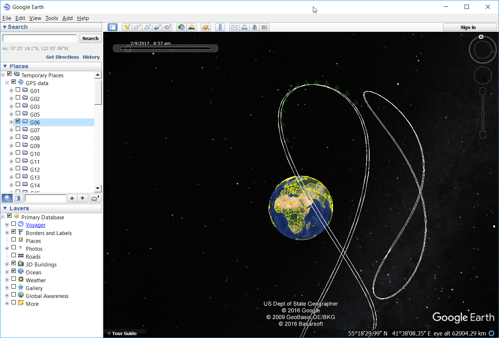

# PyGNSS - Analysis and visualization of precise GNSS orbits

Functions for downloading, time conversion, reprojection and visualization of precise GNSS orbits. GPS satellites are supported currently, Galileo and Baidu are planned.

First we have to import the package.
```python
import PyGNSS as pyg
```

We are using standard libraries, like `pandas`, `datetime`, `numpy`, `io`, `ftplib`, `subprocess`, and `os`. In addition `pyproj` is required for reprojection.

Than we download current satellite precise orbit data from FTP.
```python
orbit_fn = pyg.download_sp3() # Current time
orbit_fn = pyg.download_sp3(datetime, data_folder) # Specify time and location
```

The SP3 file has to be read and parsed to pandas DataFrame.
```python
sp3_df = pyg.read_sp3(orbit_fn)
```

We get a DataFrame similar to this.
```
vehicle,date_time,coor_x,coor_y,coor_z,clock,std_x,std_y,std_z,std_c
G01,2017-02-16 05:59:42,20817.041254,11237.897309,12227.333238,49.358711,7,9,7.0,209
G02,2017-02-16 05:59:42,-12699.223656,-22142.330686,8454.724099,474.920193,4,9,8.0,218
G03,2017-02-16 05:59:42,15161.772458000001,2522.990136,21654.710355000003,-107.445348,8,11,6.0,218
G05,2017-02-16 05:59:42,-4801.552475,-21052.092561,-15417.360146,-60.386646999999996,11,6,7.0,209
```

Next we convert ECEF coordinates to longitude, latitude and altitude. Original coordinates can be deleted or left in the DataFrame. In addition we can consider Greenwich Mean Sidereal Time.
```python
sp3_df_lla = pyg.convert_ecef2lla(sp3_df, True, True) # Remove original coordinates, consider GMST
sp3_df_lla = pyg.convert_ecef2lla(sp3_df) # Do not remove original coordinates, do not consider GMST, default
```

The satellite orbit DataFrame looks like this after conversion.
```
vehicle,date_time,clock,std_x,std_y,std_z,std_c,lat,long,alt
G01,2017-02-16 05:59:42,49.358711,7,9,7.0,209,27.370416376559717,-6327.494098728924,20256.18947880152
G02,2017-02-16 05:59:42,474.920193,4,9,8.0,218,18.353417008491363,-6475.691535287722,20513.295509668373
G03,2017-02-16 05:59:42,-107.445348,8,11,6.0,218,54.676874210567846,-6346.408384352559,20191.144848877248
G05,2017-02-16 05:59:42,-60.386646999999996,11,6,7.0,209,-35.57079350017397,-6458.704318969671,20160.960582937056
```

This DataFrame can be written to KML and later visualized in Google Earth. Orbits are displayed as lines for each of the GPS satellites. In addition for every satellite we have positions in time. Google Earth time feature enables time navigation.
```python
kml_fn = orbit_fn.split(".")[0]+".kml"
pyg.write_kml(sp3_df_lla, kml_fn)
```



Krištof Oštir and Polona Pavlovčič Prešeren  
University of Ljubljana, Faculty of Civil and Geodetic Engineering  
(c) 2017

